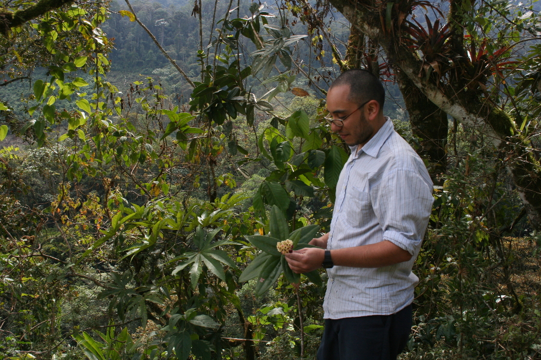
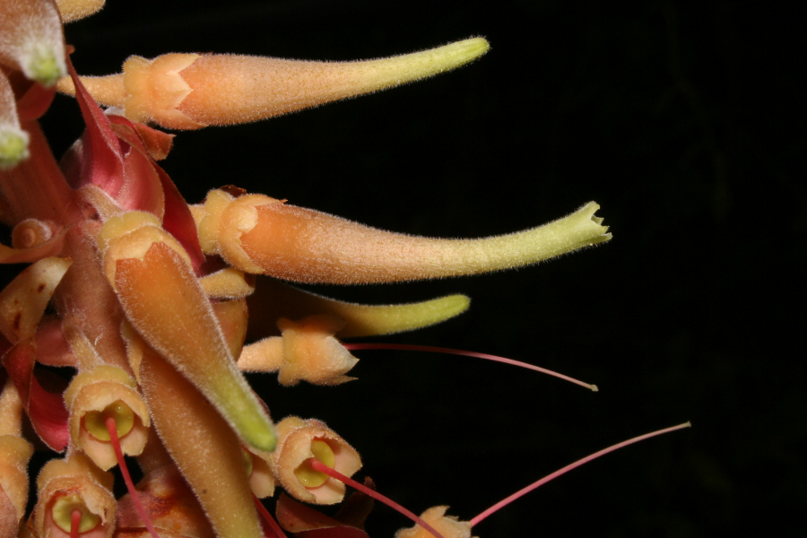

Hola. Welcome to my personal website.

Here you will find info about my research and academic activities. I am a botanist who has worked mostly on diversity, conservation, and evolutionary biology of Neotropical plants. However, during the last few years I have also become interested on biodiversity informatics and computational biology.

Currently, I am a data science consultant at the [Instituto de Hidrología, Metereología y Estudios Ambientales IDEAM](http://www.ideam.gov.co/ "IDEAM"). My work at IDEAM aims to estimate the carbon stock in Colombian forests from a variety of data sources, and improve the computational methods that are used for that purpose.

Prior to this appointment, I was a Gerstner postdoctoral fellow at the American Museum of Natural History, working under the supervision of [Ward Wheeler](https://wardwheeler.wordpress.com/).
My postdoctoral project sought to implement graph statistical models to study patterns of geographic distributions among multiple organisms; that is, to delimit areas of endemism.

I was also a research associate at [Fundación La Palmita](http://lapalmita.com.co/pagina/) (assessing the diversity and conservation status of plant communities in E Colombia), and a doctoral student at the New York Botanical Garden--City University of New York joint [graduate program](https://www.nybg.org/plant-research-and-conservation/about/education-and-outreach/commodore-matthew-perry-graduate-studies-program/ "Commodore Matthew Perry graduate program at NYBG") (working on systematics of Neotropical Blueberries).

You can access my cv [here](nrsalinas_cv.pdf "Nelson Salinas CV").

## Research interests

__1. Neotropical plant diversity and systematics.__

Tropical forests are some of the most diverse, yet endangered, ecosystems on the planet. An strategy to tackle this problem is to gather basic biological information of organisms and ecosystems that are particularly affected by anthropogenic activities. I have worked on systematics of Bromeliaceae (pineapples), Costaceae (spiral gingers), and Ericaceae (blueberries), and conducted general diversity surveys in Amazonian, Andean, and Choco forests from my home country, Colombia. I have conducted most of this work with collaborators from the [Instituto de Ciencias Naturales](http://ciencias.bogota.unal.edu.co/icn/ "ICN"), [Instituto Sinchi](http://www.sinchi.org.co/), and the [New York Botanical Garden](http://www.nybg.org/science-new/).

__2. Biogeography.__

Recognizing spatial patterns (biogeographic regions, areas of endemism, etc.) from geographic distributions of organisms is one of the main tasks of biogeography. However, biogeography has been marginalized from the statistical revolution that has recently transformed other subdisciplines of comparative biology. As a way to contribute towards such goals, I am currently working on the implementation of a kind of graphical statistical models (Hidden Markov Random Fields) to uncover areas of endemism from geographic distribution data.

### Contact

Nelson R. Salinas  
nrsalinas@gmail.com

______

This website is hosted by GitHub Pages, and generated through the Jekyll theme [Solo](http://chibicode.github.io/solo) by Shu Uesugi.
